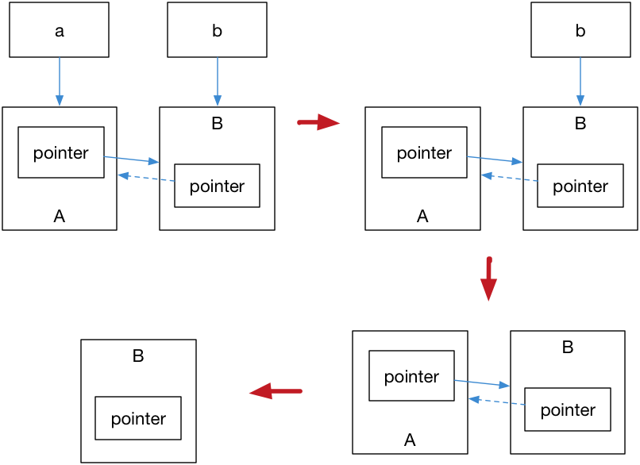

了解Objective-C/Swift的程序员应该知道[引用计数](https://transformerswsz.github.io/2017/08/21/iOS%E5%86%85%E5%AD%98%E7%AE%A1%E7%90%86/)的概念。引用计数这种计数是为了防止内存泄露而产生的。 基本想法是对于动态分配的对象，进行引用计数，每当增加一次对同一个对象的引用，那么引用对象的引用计数就会增加一次， 每删除一次引用，引用计数就会减一，当一个对象的引用计数减为零时，就自动删除指向的堆内存。

<!--more-->

在传统C++中，程序员需要手动释放资源，经常忘记去释放资源而导致泄露。通常的做法是对于一个对象而言，我们在构造函数的时候申请空间，而在析构函数（在离开作用域时调用）的时候释放空间， 也就是我们常说的 RAII资源获取即初始化技术。

传统C++里我们使用`new`和`delete`去申请和释放资源，两者必须配对写，`new`会返回一个裸指针，即`Object *`这种形式。而C++11引入了智能指针的概念，使用了引用计数的想法，让程序员不再需要关心手动释放内存。 这些智能指针包括：
- `shared_ptr`
- `unique_ptr`
- `weak_ptr`

使用它们需要包含头文件`memory`，下面进行详细介绍。

## `shared_ptr`
`shared_ptr`是一种智能指针，它能够记录多少个`shared_ptr`共同指向一个对象，从而消除显式的调用`delete`，当引用计数变为零的时候就会将对象自动删除。

- `make_shared`用来消除显式的使用`new`，它会分配创建传入参数中的对象，并返回这个对象类型的`shared_ptr`指针。
- `shared_ptr`可以通过`get()`方法来获取原始指针，通过`reset()`来减少一个引用计数， 并通过`use_count()`来查看一个对象的引用计数。

下面是关于 `shared_ptr` 的示例：
```cpp
#include <iostream>
#include <memory>

using namespace std;

int main()
{
	auto p = make_shared<int>(10);
	(*p)++;
	cout << *p << endl;

	auto p1 = p;
	auto p2 = p1;
	cout << "p count: " << p.use_count() << endl;	// 3
	cout << "p1 count: " << p1.use_count() << endl;	// 3
	cout << "p2 count: " << p2.use_count() << endl;	// 3
	cout << "---------------" << endl;

	p1.reset();
	cout << "p count: " << p.use_count() << endl;	// 2
	cout << "p1 count: " << p1.use_count() << endl;	// 0
	cout << "p2 count: " << p2.use_count() << endl;	// 2
	cout << "---------------" << endl;

	p.reset();
	cout << "p count: " << p.use_count() << endl;	// 0
	cout << "p1 count: " << p1.use_count() << endl;	// 0
	cout << "p2 count: " << p2.use_count() << endl;	// 1
	return 0;
}
```

#### 特点
- 占用内存高：因为除了要管理一个裸指针外，还要维护一个引用计数器。
- 原子操作性能低：虑到线程安全问题，引用计数的增减必须是原子操作。而原子操作一般情况下都比非原子操作慢。

#### 使用场景
- 通常使用在共享权不明的场景，有可能多个对象同时管理同一个内存。
- 对象的延迟销毁，当一个对象的析构非常耗时，甚至影响到了关键线程的速度。可以使用 `BlockingQueue<shared_ptr<void>>`将对象转移到另外一个线程中释放，从而解放关键线程（陈硕-《Linux多线程服务器端编程》）。


## `unique_ptr`
`unique_ptr`是一种独占的智能指针，它禁止其他智能指针与其共享同一个对象，从而保证代码的安全。`unique_ptr`只支持移动，不支持赋值：
```cpp
unique_ptr<int> pointer = make_unique<int>(10);
unique_ptr<int> pointer2 = pointer; // 非法
unique_ptr<int> pointer3 = move(pointer); // 合法
```

下面是关于 `unique_ptr` 的示例：
```cpp
#include <iostream>
#include <memory>

struct Foo {
	Foo() { cout << "construct Foo" << endl; }
	~Foo() { cout << "delete Foo" << endl; }
	void foo(int i) { cout << "point" << i << " is not null. Here is Foo:foo" << endl; }
};

void f(const Foo& foo, int i) {
	cout << "point" << i << " call outer function" << endl;
}

int main()
{
	unique_ptr<Foo> p1(make_unique<Foo>());
	// p1 不空, 输出
	if (p1)
	{
		p1->foo(1);
	}
	{
		unique_ptr<Foo> p2(move(p1));
		// p2 不空, 输出
		f(*p2, 2);
		// p2 不空, 输出
		if (p2) p2->foo(2);
		// p1 为空, 无输出
		if (p1) p1->foo(1);
		p1 = move(p2);
		// p2 为空, 无输出
		if (p2) p2->foo(2);
		cout << "p2 被销毁" << endl;
	}
	// p1 不空, 输出
	if (p1) p1->foo(1);
	return 0;
}
```

#### 特点
- `unique_ptr`在默认情况下和裸指针的大小是一样的。所以内存上没有任何的额外消耗，性能是最优的。

#### 使用场景
- 忘记`delete`:
```cpp
class Widget
{
public:
	Widget() {}
	~Widget() {}
	void do_something()
	{
		cout << "Here is Widget!" << endl;
	}
};

class Box
{
public:
	Box(): w(new Widget())
	{}
	~Box()
	{
		/*delete w;*/
	}
	void call_widget()
	{
		w->do_something();
	}
private:
	Widget* w;
};
```
如果因为一些原因，`w`必须建立在堆上。如果用裸指针管理`w`，那么需要在析构函数中 `delete w`，但程序员容易漏写该语句，造成内存泄漏。

如果按照`unique_ptr`的写法，不用在析构函数手动`delete`属性。当对象析构时，属性`w`将会自动释放内存。

- 异常安全
假如我们在一段代码中，需要创建一个对象，处理一些事情后返回，返回之前将对象销毁，如下所示：
```cpp
void process()
{
    Widget* w = new Widget();
    w->do_something(); // 可能会发生异常
    delete w;
}
```
在正常流程下，我们会在函数末尾`delete`创建的对象`w`，正常调用析构函数，释放内存。

但是如果`w->do_something()`发生了异常，无法执行到`delete w`。此时就会发生内存泄漏。
我们当然可以使用`try…catch`捕捉异常，在 `catch`里面执行`delet`，但是这样代码上并不美观，也容易漏写。

如果我们用`unique_ptr`，那么这个问题就迎刃而解了。无论代码怎么抛异常，在`unique_ptr`离开函数作用域的时候，内存就将会自动释放。

## `weak_ptr`
看如下代码；
```cpp
struct A;
struct B;

struct A {
    shared_ptr<B> pointer;
    ~A() {
        cout << "A 被销毁" << endl;
    }
};
struct B {
    shared_ptr<A> pointer;
    ~B() {
        cout << "B 被销毁" << endl;
    }
};
int main() {
    auto a = make_shared<A>();
    auto b = make_shared<B>();
    a->pointer = b;
    b->pointer = a;
}
```
运行结果是 A, B 都不会被销毁，这是因为 a,b 内部的 pointer 同时又引用了 a,b，这使得 a,b 的引用计数均变为了 2，而离开作用域时，a,b 智能指针被析构，却只能造成这块区域的引用计数减一，这样就导致了 a,b 对象指向的内存区域引用计数不为零，而外部已经没有办法找到这块区域了，也就造成了内存泄露，如图所示：


解决这个问题的办法就是使用弱引用指针`weak_ptr`，它是一种弱引用（相比较而言`shared_ptr`就是一种强引用）。弱引用不会引起引用计数增加，当换用弱引用时候，最终的释放流程如图下图所示：



在上图中，最后一步只剩下 B，而 B 并没有任何智能指针引用它，因此这块内存资源也会被释放。

`weak_ptr`没有`*`运算符和`->`运算符，所以不能够对资源进行操作，它可以用于检查`shared_ptr`是否存在，其`expired()`方法能在资源未被释放时，会返回`false`，否则返回`true`；除此之外，它也可以用于获取指向原始对象的`shared_ptr`指针，其`lock()`方法在原始对象未被释放时，返回一个指向原始对象的`shared_ptr` 指针，进而访问原始对象的资源，否则返回`nullptr`。


## 总结
在日常使用中，`unique_ptr`使用频率最高，`weak_ptr`最低，需要避免循环引用的情况。当然，还是要根据具体的业务场景和性能要求来选择哪种指针。

___

## 参考
- [C++ 智能指针的正确使用方式](https://www.cyhone.com/articles/right-way-to-use-cpp-smart-pointer/)
- [智能指针与内存管理](https://changkun.de/modern-cpp/zh-cn/05-pointers/#5-4-std-weak-ptr)