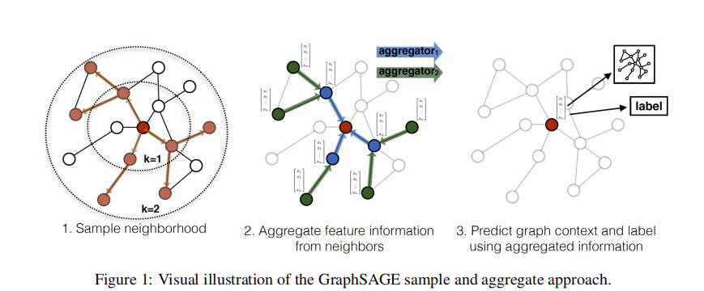
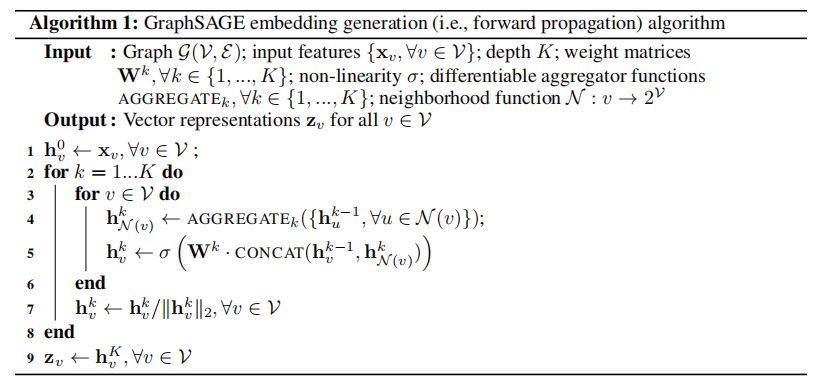

传统的图方法都是直推式(transductive)的，学习到的是结构固定的图模型，一旦有新的节点加入，便需要重新训练整个图网络，泛化性不强。GraphSAGE是归纳式(inductive)的，它学习一种映射：通过采样和聚合邻居节点信息来生成当前节点的表征。GraphSAGE可扩展性更强，对于节点分类和链接预测问题的表现也比较突出。

<!--more-->

## 模型结构

1. 采样一跳和二跳的邻居节点
2. 聚合邻居节点的特征信息
3. 预测图上下文和当前节点标签信息

## 算法流程

整体上还是非常通俗易懂的。

## 损失函数

- 有监督：跟常规的分类任务一样，使用交叉熵损失函数
- 无监督：根据节点间共现关系来定义损失函数：

$$
J_{\mathcal{G}}\left(\mathbf{z}_u\right)=-\log \left(\sigma\left(\mathbf{z}_u^{\top} \mathbf{z}_v\right)\right)-Q \cdot \mathbb{E}_{v_n \sim P_n(v)} \log \left(\sigma\left(-\mathbf{z}_u^{\top} \mathbf{z}_{v_n}\right)\right)
$$

- $u$ 表示当前节点，而 $v$ 是跟它在一条随机路径上共现的节点，两者相似，内积很大，则 $-\log \left(\sigma\left(\mathbf{z}_u^{\top} \mathbf{z}_v\right)\right)$ 接近0
- $P_n(v)$ 表示负采样分布，$Q$ 为负样本个数，$u$ 与 $v_n$ 负内积很大，则 $-Q \cdot \mathbb{E}_{v_n \sim P_n(v)} \log \left(\sigma\left(-\mathbf{z}_u^{\top} \mathbf{z}_{v_n}\right)\right)$ 接近 0

## 实验结果

在三个数据集上大幅领先baseline。

___

## 参考
- [图神经网络10-GraphSAGE论文全面解读](https://zhuanlan.zhihu.com/p/367741877)