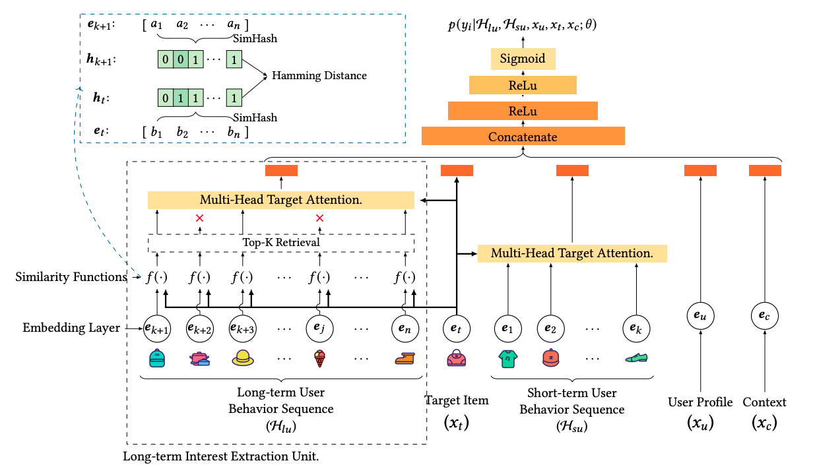
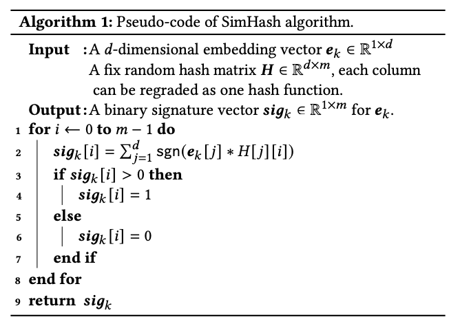

用户序列长度跟模型AUC有直接正相关性，模型能处理的序列长度越长，AUC就越高。但长序列对于样本处理和模型训练非常不友好，耗时长且显存占用大。更重要的是线上预估服务的约束，必须要在规定时间内完成推算。针对长序列的建模，出现了如下代表性工作：

## DIN
具体的讲解见：[DIN解读](https://transformerswsz.github.io/2023/02/12/DIN%E8%A7%A3%E8%AF%BB/)

## SIM
SIM利用两阶段来捕捉用户在广告上的精准兴趣表达：
1. 提出GSU(General Search Unit)结构：从原始的超长用户行为中根据广告信息搜索到和广告相关的用户行为。搜索后的用户行为数据能够由原来的上万长度降低到数百长度，与此同时大部分和当前广告无关的信息都会被过滤。搜索方法有如下两种：
    - hard模式：将该用户行为序列中与target item具有相同类别的items聚合起来
    - soft模式：用聚类方法将用户行为序列中的items进行聚类
2. 提出ESU(Exact Search Unit，精准搜索单元)结构：利用第一阶段提取出和广告相关的用户行为和候选的广告信息来精准建模用户的多样兴趣。在ESU中，采用类似DIN这样复杂的模型来捕捉用户和广告相关的动态兴趣表达

#### SIM存在的问题
- 目标不一致：GSU建立索引使用的item embedding不是SIM模型生成的，可能是预训练的，也有可能是直接拿item的类别建立的索引，本质上是内容embdding上的索引。但是SIM模型本身的item embdding不一定是这样的内容embdding，要不然就不会有啤酒尿布这样经典的案例（毕竟啤酒和尿布分属不同类别）
- 更新频率不一致：SIM两阶段的更新频率不一致。线上模型都是以online learning的方式频繁更新的，以捕捉用户实时的兴趣变化，但是SIM中所使用的索引都是离线建立好的，成为性能的短板

## ETA
模型结构如下：

SimHash伪代码如下：

___

## 参考
- [再见Attention：建模用户长期兴趣的新范式](https://zhuanlan.zhihu.com/p/540579632)
- [长序列建模（一）：阿里ETA（End-to-end Target Attention）模型](https://zhuanlan.zhihu.com/p/547087040)
- [长序列建模（二）：美团SDIM（Sampling-based Deep Interest Modeling）模型](https://zhuanlan.zhihu.com/p/560657191)

